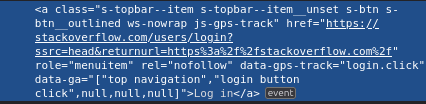
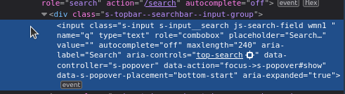

# ФРЕЙМОВР НА ІНШІЙ ГІЛЦІ.ЧЕКНІТЬ БУДЬ ЛАСКА.ЗРобив все що встиг.Світло виключають

# Завдання з тестування
# V11

## Task 1

[Перейти до завдання 1](https://docs.google.com/spreadsheets/d/1ejKdhOK9z3KQ7oBaWkIMNROGwm4WUnkmxqjykY061Yg/edit?gid=0#gid=0)

## Task 2

Оголосіть і ініціалізуйте змінну типу `String` з ім'ям і змінну типу `float` з зарплатою. Використайте метод
`String.format` для форматування рядка, щоб відобразити ім'я та зарплату в реченні. Надрукуйте результат на консоль.

## Task 3

**Реверс масиву:** Напишіть програму на Java, яка приймає масив цілих чисел і реверсує його елементи. Ваша програма має
запросити у користувача введення розміру масиву та елементів масиву, а потім вивести реверсований масив.

Створіть `ArrayList` з отриманого масиву і виконайте наступні операції:
a) Додайте елемент до кінця списку;  
b) Видаліть елемент зі списку;  
c) Замініть елемент у списку;  
d) Відсортуйте список в алфавітному порядку;  
e) Виведіть елементи списку.

Створіть ситуацію для `NullPointerException`. Обробіть її та виведіть пояснення для вашого користувацького випадку.

## Task 4

a) Створіть потік, який чекає сигналу від іншого потоку, використовуючи методи `wait` і `notify`.

b) Створіть власний клас з кількома конструкторами та створіть об'єкт цього класу. Використайте метод
`getDeclaredConstructors()` для виведення всіх конструкторів класу та їх типів параметрів. Виберіть конкретний
конструктор і створіть новий екземпляр класу, використовуючи `newInstance()`. Надрукуйте результати або хід виконання.

c) Створіть загальний клас, який може зберігати список елементів будь-якого типу, і додайте елементи до нього,
використовуючи `List<T>` і метод `add()`.

## Task 5

### Серіалізація-Десеріалізація:
a) Створити кілька складних моделей, використовуючи свій варіант.  
b) Зробити ці моделі серіалізованими.  
c) Прочитати JSON з файлу "input.json".  
d) Десеріалізувати його у POJO (Plain Old Java Object).  
e) Змінити кілька полів і зберегти результат у файл "output.json".  
f) Виконати те саме для XML.

### Потік (Stream):
a) Згенерувати 10 випадкових об'єктів, використовуючи клас із попереднього завдання.  
b) Відсортувати їх за двома будь-якими полями за допомогою потоку (Stream).  
c) Відфільтрувати за двома будь-якими полями за допомогою кастомного фільтра.  
d) Зібрати результати у список із *основним(-и) полем(-ами).

### Написати команду Maven для виконання одного з ваших завдань із аргументами (кількість елементів).

## Task6

1. Встановити сервер MySQL (або будь-яку іншу SQL-подібну базу даних).
2. Створити як мінімум дві таблиці (сутності з попереднього завдання або додаткові, якщо потрібно).
3. Створити моделі для цих сутностей (з Task_5).
4. Налаштувати Hibernate для цих сутностей і локальної бази даних.
5. Перевірити базові CRUD операції (створення, читання, оновлення та видалення записів у базі даних, використовуючи Hibernate).
6. Згенерувати кілька записів у всі таблиці.

## Task7

1. Реалізувати відносини OneToOne, OneToMany, і ManyToMany у ваших моделях з попереднього завдання (Task_6).
2. Перевірити це за допомогою CRUD операцій.

## Task8

1. Створити 3 прості юніт-тести для Task_2 (змодифікувати код, щоб у Task_2 було 3 різних методи, якщо це необхідно).
2. Створити файл `testng.xml`, який повинен виконати ваш тестовий клас. Виконати цей файл.
3. Додати Data Provider для кожного тесту.
4. Створити тест із параметрами, завантаженими з файлу `testng.xml`.

## Task9

1. Перейти на будь-який сайт на вибір (наприклад: http://stackoverflow.com).
2. Вибрати будь-які 3 різні елементи (кнопка, поле вводу, випадаючий список тощо).
3. Написати та перевірити у консолі браузера CSS локатори для цих елементів.
4. Написати та перевірити у консолі браузера XPATH локатори для цих елементів (використовуй функції, якщо потрібно).

### Результати завдання:
- Login button: css: .s-topbar--item.s-btn__outlined , xpath: //a[@class='s-topbar--item s-btn__outlined' and text()='Log in']

 

- Search bar: css: .s-input__search, xpath: //input[@name='q']

 

- Dropdown: css: .s-navigation--item.js-products-menu.is-selected,
xpath: //li/a[@class='s-navigation--item js-products-menu is-selected' and text()='Products']

 

## Task10

1. Налаштувати ChromeDriver, використовуючи файл драйвера та властивості.
2. Налаштувати ChromeDriver, використовуючи DriverManager.
3. Перейти на сторінку, призначену вашому варіанту.
4. Вибрати три різні елементи.
5. Взаємодіяти з усіма вибраними елементами.
6. Перевірити видимість кожного елемента за допомогою assert-ів.
7. Об'єднати всі ці кроки у тестовий випадок TestNG.

## Task11

1. Створи простий UI end-to-end тестовий кейс для твоєї тестової сторінки з Task_10.
2. Автоматизуй цей сценарій за допомогою WebDriver.
3. Створи PageObject (використай Business Object за потреби) для всіх сторінок, що використовуються в сценарії.

### Приклад сценарію (новий акаунт):

- Перейди на сторінку реєстрації.
- Введи дійсну email-адресу, ім'я користувача та надійний пароль.
- Натисни кнопку "Sign Up".
- Перевір, що користувач перенаправлений на домашню сторінку.
- Перевір, що акаунт користувача створено та він увійшов у систему.